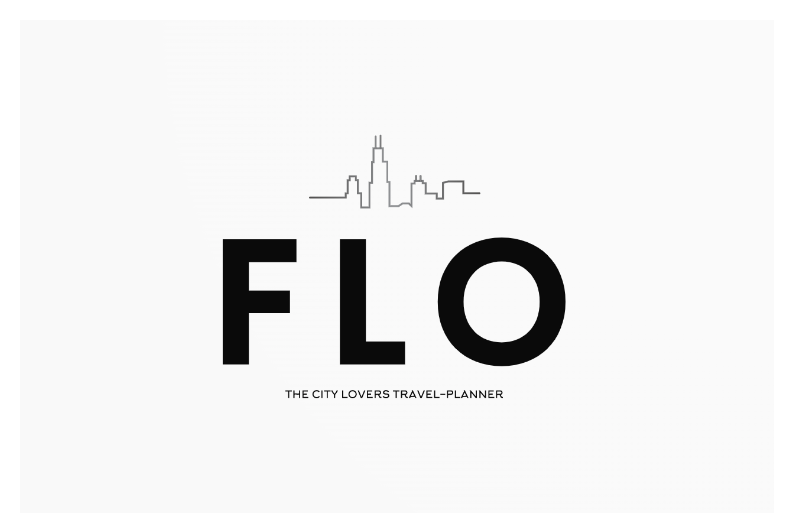

Flo is 'The city lovers travel-planner' that suggest how many days people should spend to visit a city and provide a plan whit the main things to see and to do in that city.

# Getting Started

1. Clone the repo

git clone https://github.com/irenecgn/flo.git
cd FLO

2. Install dependencies

npm install

3. Start development server

npm start

# Built with

React - Front end library for building user interfaces
Styled Components - Library used to style React application
Express - Node.js web application framework
MongoDB - document oriented database

# Contributing

Improvement are welcome, submit a pull request :)

# Author

Irene Cagnoni
