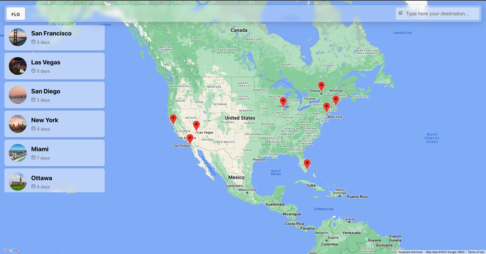
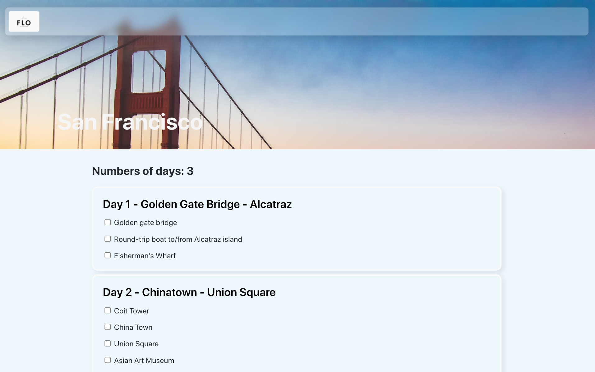

# FLO - The City Lovers Travel Planner

## Table of Content

- [Introduction](#introduction)
- [Screenshots](#screenshots)
- [Getting started](#getting-started)
- [Tech Stack](#tech-stack)

## Introduction

Flo is a travel-planner dedicated to city lovers travellers that provides to-do plans, maps and a note-taking tool.

It suggest you how many days you should spend to visit a city and provides a plan whit the main things to see and do in that city.

## Screenshots





# Getting Started

1. Clone this repo and enter!

```bash
git clone https://github.com/irenecgn/flo.git
cd FLO
```

2. Install dependencies.

```bash
npm install
```

3. Start the development environment

```bash
nodemon flo-server/index.js
cd flo-client
npm start
```

# Tech Stack

- [create-react-app](https://create-react-app.dev/)
- [Styled Components](https://styled-components.com/)
- [Express](https://expressjs.com/)
- [MongoDB](https://www.mongodb.com/home)

# Contributing

Improvement are welcome, submit a pull request :)

# Author

Irene Cagnoni
